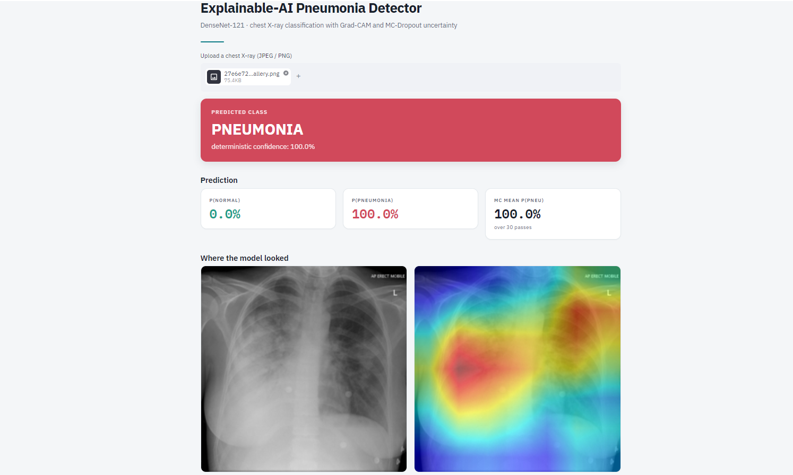
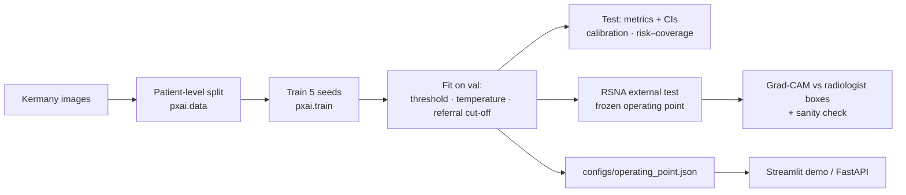

<div align="center">

# Explainable Pneumonia Triage from Chest X-rays

DenseNet-121 · Grad-CAM · MC-Dropout uncertainty · selective referral

[](https://github.com/eseeyuh/pneumonia-xai-detector/actions/workflows/ci.yml)
[](https://pneumonia-xai-detector-7wm8j5lwmpnfbs4sedyhdo.streamlit.app)
[](https://huggingface.co/eseeyuh/pneumonia-xai-detector)
[](LICENSE)


</div>

A classifier that says *pneumonia / normal* is not enough for triage. This project asks three questions of every prediction:

1. **What does the model predict?** DenseNet-121 fine-tuned on paediatric chest X-rays.
2. **Why?** Grad-CAM maps, evaluated *quantitatively* against radiologist bounding boxes, not just shown.
3. **Should a human look at this case?** MC-Dropout uncertainty decides which cases are referred, and risk–coverage analysis measures whether that referral actually removes errors.



> [!IMPORTANT]
> **v0.2: the pipeline was rebuilt and all results are being recomputed.**
> The metrics published with v0.1 (AUC 0.9975, accuracy 0.9676) came from a re-split of the pooled Kermany dataset that was not verified to be patient-level. The dataset contains several images per child, so the same patient may have appeared in both training and test data, and the original training code is no longer available to check. Those numbers are withdrawn until recomputed. The new pipeline splits strictly by patient, keeps the official test set intact, and reports confidence intervals and external validation. See [docs/PAPER_PROTOCOL.md](docs/PAPER_PROTOCOL.md).

> [!WARNING]
> Research prototype, **not a medical device**. Trained on children aged 1–5 from a single hospital; not validated for clinical use.

---

## What's inside

| Area | What it does |
|---|---|
| **Leak-free data** | Patient IDs parsed from Kermany filenames; patient-level splits; training refuses to start if any patient is shared between splits; `--audit` measures how much a naive split would leak |
| **Honest evaluation** | Operating point, temperature and referral threshold fitted on *validation*, frozen for test; patient-level (cluster) bootstrap 95% CIs; sensitivity-targeted threshold for triage |
| **Uncertainty** | MC-Dropout (predictive entropy, mutual information, variance) vs. max-softmax, softmax entropy, test-time augmentation and a deep ensemble; AURC, E-AURC, accuracy at fixed coverage |
| **Calibration** | ECE, Brier, NLL, reliability diagrams, temperature scaling |
| **Explainability** | Grad-CAM and Grad-CAM++ scored with pointing game, energy-in-box and IoU against RSNA boxes, plus the Adebayo et al. model-randomisation sanity check |
| **External validation** | RSNA Pneumonia Detection Challenge (adults, different hospital) with the frozen operating point |
| **Serving** | Streamlit demo, FastAPI endpoint, Docker image; thread-safe inference, DICOM and 16-bit PNG input |

### One engineering detail worth knowing

Dropout lives only in the classifier head, so MC-Dropout does not need T full forward passes: the backbone runs once and only the 1024→2 head is resampled. The result is mathematically identical (checked by a unit test) and **33× faster** on CPU for T = 30 (3.1 s → 0.09 s). Because the model is never switched into train mode, it is also safe to share between concurrent users.

## Pipeline



## Quick start

```bash
git clone https://github.com/eseeyuh/pneumonia-xai-detector.git
cd pneumonia-xai-detector
python -m venv .venv && source .venv/bin/activate   # Windows: .venv\Scripts\activate
pip install -r requirements.txt
streamlit run app.py
```

Weights download automatically from the Hugging Face Hub on first run. To use a local file: `PXAI_WEIGHTS=path/to/best.pt streamlit run app.py`.

**REST API**

```bash
pip install -e ".[api]"
uvicorn api.main:app --port 8000
curl -F "file=@xray.png" "http://localhost:8000/predict?mc_samples=30"
```

**Docker**

```bash
docker build -t pxai .
docker run -p 8501:8501 pxai                                                # demo
docker run -p 8000:8000 pxai uvicorn api.main:app --host 0.0.0.0 --port 8000 # API
```

## Reproducing the paper

The easiest route is the Colab notebook [`notebooks/reproduce_colab.ipynb`](notebooks/reproduce_colab.ipynb). The same steps from a terminal:

```bash
pip install -e ".[research]"

# 1. data: Kaggle "paultimothymooney/chest-xray-pneumonia" → data/chest_xray
python -m pxai.data --root data/chest_xray --audit          # leakage of a naive split
python -m pxai.data --root data/chest_xray --mode official --out data/splits/kermany.csv

# 2. train five seeds
for s in 42 1 2 3 4; do
  python -m pxai.train --config configs/default.yaml --set seed=$s output_dir=runs/seed$s
done

# 3. internal test (operating point fitted on val)
python -m pxai.evaluate --manifest data/splits/kermany.csv --root data/chest_xray \
  --checkpoints runs/seed{42,1,2,3,4}/best.pt --tta-samples 16 --out results/kermany

# 4. external test + saliency evaluation on RSNA
python scripts/prepare_rsna.py --rsna-dir data/rsna --out-dir data/rsna_png
python -m pxai.evaluate --manifest data/splits/rsna.csv --root . \
  --checkpoints runs/seed42/best.pt --operating-point results/kermany/operating_point.json --out results/rsna
python scripts/eval_saliency.py --manifest data/splits/rsna.csv --boxes data/splits/rsna_boxes.csv \
  --checkpoint runs/seed42/best.pt --out results/saliency
```

Each run writes `metrics.json`, per-image `predictions_*.csv`, `operating_point.json` and PNG/PDF figures (ROC, reliability, risk–coverage). Copy `results/kermany/operating_point.json` to `configs/` and the demo will use the calibrated threshold.

## Results

*Being recomputed under the v0.2 protocol.* The table below will be filled from `results/*/metrics.json`.

| Test set | AUC [95% CI] | Sensitivity | Specificity | ECE (after T-scaling) | Acc. at 80% coverage |
|---|---|---|---|---|---|
| Kermany official test (paediatric) | – | – | – | – | – |
| RSNA (adult, external) | – | – | – | – | – |

## Repository layout

```
pxai/                 library: data, model, uncertainty, metrics, xai, train, evaluate, inference
scripts/              RSNA preparation, saliency evaluation
configs/              experiment config (+ operating_point.json once evaluated)
notebooks/            Colab reproduction notebook
app.py                Streamlit demo
api/                  FastAPI service
tests/                35 unit and end-to-end tests (CPU, no data needed)
docs/                 paper protocol, roadmap, model card
```

## Limitations and intended use

- **Population.** Kermany contains children aged 1–5 from one hospital in Guangzhou. Performance on adults, other scanners and other hospitals is expected to be lower; the RSNA experiment measures how much lower.
- **Labels.** Image-level labels from the original dataset; no radiologist re-reading.
- **Shortcut learning.** Paediatric datasets are known to contain non-anatomical cues (markers, positioning, image borders). Grad-CAM is used to look for them, but saliency maps cannot prove their absence.
- **Uncertainty is not out-of-distribution detection.** A confident prediction on an unusual image is still possible; the demo only flags obviously wrong inputs (colour photos, extreme aspect ratios).
- **Intended use:** research and education. Not for diagnosis.

## Citation

```bibtex
@misc{shaidarov2025pneumonia,
  title  = {Explainable Pneumonia Triage from Chest X-Rays},
  author = {Shaidarov, Daryn},
  year   = {2025},
  note   = {University of Portsmouth. Supervised by Dr Alexander Gegov.},
  url    = {https://github.com/eseeyuh/pneumonia-xai-detector}
}
```

## Acknowledgements

Data: Kermany, Zhang & Goldbaum, *Labeled Optical Coherence Tomography (OCT) and Chest X-Ray Images for Classification*, Mendeley Data (CC BY 4.0); RSNA Pneumonia Detection Challenge (RSNA / NIH). Supervision: Dr Alexander Gegov, University of Portsmouth.
